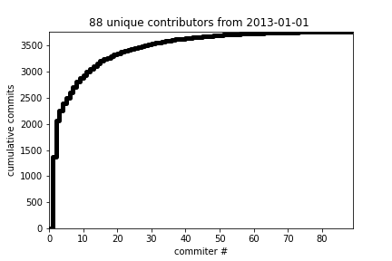

---
# YAML metadata
title: "Nibabel - optional attachments"
linkcolor: blue
urlcolor: blue
bibliography: czi.bib
<#ifndef HANDOUT>
suppress-bibliography: true
<#endif>
---

Cumulative commits by first $n$ committers, where committers ordered by number
of commits; $n$ is on the x-axis.  Although there is a tendency for a small number of committers to contribute a lot of the code, there are a substantial number of committers with more than a trivial number of commits.

Number of commits per month since 2013.  Project activity is stable, trending upwards.

<#ifdef HANDOUT>
# References
<#endif>
