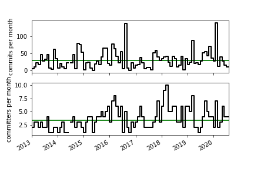
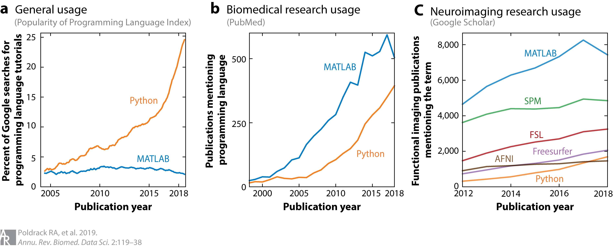

---
# YAML metadata
title: "Nibabel - optional attachments"
linkcolor: blue
urlcolor: blue
bibliography: czi.bib
geometry: margin=2cm
fontfamily: arev
fontsize: 12pt
---

## Nibabel commit activity

Number of commits per month since 2013.  Project activity is stable, trending
upwards.

{height=400}

## Metrics of Neuroimaging package uptake

> Usage of the MATLAB and Python programming languages (a) in general, (b) in
biomedical research, and (c) in neuroimaging research. The data in panel
a come from the PYPL (Popularity of Programming Language) Index, which tracks
Google searches for programming-language tutorials. The data in panel b show
the number of publications per year on PubMed that mention “MATLAB” or
“Python.” The data in panel c show mentions of major software packages in
functional brain imaging publications (counts on Google scholar). SPM
(statistical parametric mapping) is MATLAB based, while FSL [FMRIB (functional
magnetic resonance imaging of the brain) Software Library] and AFNI (Analysis
of Functional NeuroImages) build increasingly on Python.

From Poldrack, Russell A., Krzysztof J. Gorgolewski, and Gaël Varoquaux. 2019. *Computational and Informatic Advances for Reproducible Data Analysis in Neuroimaging* Annual Review of Biomedical Data Science 2 (1): 119–38. <https://doi.org/10.1146/annurev-biodatasci-072018-021237>.

## Links to related packages

* [Nipy community](https://nipy.org): Community of practice for Python in
  neuroimaging.
* [SPM](https://www.fil.ion.ucl.ac.uk/spm): Matlab API and toolbox to analyze
  function brain imaging data.
* [AFNI](https://afni.nimh.nih.gov): "AFNI is a set of C programs for
  processing, analyzing, and displaying functional MRI (FMRI) data".
* [FSL](https://fsl.fmrib.ox.ac.uk): GUI and command line library of tools for
  analyzing various MRI data, including functional, structural and diffusion
  data.
* [FreeSurfer](https://surfer.nmr.mgh.harvard.edu): "An open source software
  suite for processing and analyzing (human) brain MRI images" specializing in
  analysis of cortical surface data.
* [Nilearn](https://nilearn.github.io): "Python module for fast and easy
  statistical learning on NeuroImaging data."
* [MNE](https://mne.tools): "Python software for exploring, visualizing, and
  analyzing human neurophysiological data: MEG, EEG, sEEG, ECoG, and more."
* [Xarray](http://xarray.pydata.org): extends Numpy arrays with labels and
  attributes.
* [2i2c](https://2i2c.org): The International Interactive Computing
  Collaboration.
* [Dcmstack](https://github.com/moloney/dcmstack): "DICOM to Nifti conversion
  with the added ability to extract and summarize meta data from the source
  DICOMs."
